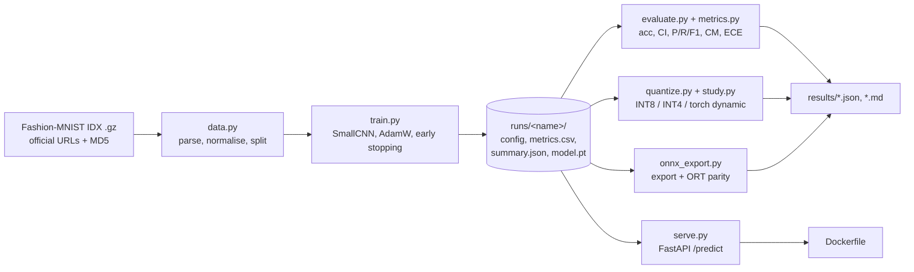

# qvision

A reproducible CPU-based PyTorch project for small Fashion-MNIST CNN training, evaluation with confidence intervals and calibration, weight quantization, ONNX export, and FastAPI serving.

Repository: [srujanmalakpata/qvision](https://github.com/srujanmalakpata/qvision).

The custom symmetric per-channel INT8/INT4 weight quantizer is compared with PyTorch's built-in
dynamic quantization for accuracy, size and CPU latency. ONNX Runtime parity is checked on the
full test set. A FastAPI `/predict` endpoint serves the model locally or in Docker. Training and
inference run on CPU, and tests require no network. The results below include load-dependent
latency measurements; see the limitations.

## Features

- **Data pipeline without torchvision**: downloads Fashion-MNIST from the official URLs, checks
  the published MD5s, parses the IDX format with NumPy, and makes a seeded train/val split.
- **Deterministic training**: seeded RNGs, `torch.use_deterministic_algorithms(True)`, AdamW
  with cosine decay, early stopping that restores the best weights (unit-tested; it did not
  trigger in the reported run), a hard failure on NaN/inf losses, and a YAML config.
- **File-based run tracking**: each run directory gets `config.yaml`, `env.json`,
  `metrics.csv` and `summary.json`.
- **Evaluation**: accuracy with a bootstrap 95% CI, macro-F1, per-class precision/recall/F1,
  a confusion matrix, and ECE (15 bins) with its reliability table, all implemented in NumPy.
  The tests check the confusion matrix and P/R/F1 against scikit-learn, McNemar against SciPy,
  and ECE and the bootstrap against hand-computed cases.
- **Custom quantizer** (`src/qvision/quantize.py`): symmetric per-output-channel INT8 and INT4
  (two values packed per byte), with drop-in `QuantConv2d`/`QuantLinear` modules.
- **Quantization study**: fp32, own INT8, own INT4 and `torch.ao` dynamic INT8, compared on
  accuracy delta (with a *paired* test against fp32: exact McNemar p-value and a
  paired-bootstrap CI of the delta), top-1 agreement, serialized size, and interleaved CPU
  latency at batch 1 and batch 256.
- **ONNX export** with the `torch.export`-based exporter and a dynamic batch dimension. ONNX
  Runtime parity is checked on all 10,000 test images.
- **FastAPI service**: `POST /predict` takes a 28×28 PNG and returns the label, the confidence
  and all 10 probabilities. `GET /health` is also available. It can serve the INT8/INT4 variant
  through an env var. Request size is checked from `Content-Length` before the body is read,
  PNG dimensions and mode are checked from the header before decoding, and inference runs in
  the threadpool so it never blocks the event loop (torch is capped at `QV_TORCH_THREADS`,
  default 1, so concurrent requests do not oversubscribe the CPU).
- **Docker image** (two-stage build, CPU torch, non-root user, healthcheck, no ONNX/dev
  packages) and a **GitHub Actions CI workflow** (ruff, pytest, a real training smoke run, and a
  Docker build with a container smoke test). The image was built and smoke-tested locally; the
  workflow has not run on GitHub yet.

## Quick start

Requires Python 3.11 and [uv](https://docs.astral.sh/uv/). `uv sync` creates a project-local
`.venv` with the CPU-only PyTorch wheel from `download.pytorch.org/whl/cpu`.

```bash
make setup         # uv sync
make all           # download, train, evaluate, quantize, export ONNX (7-35 min on 2 threads)
make serve         # http://127.0.0.1:8000/docs
make sample        # writes sample.png from the test set
curl -F "file=@sample.png;type=image/png" http://127.0.0.1:8000/predict
```

Individual steps: `uv run qvision {download,train,evaluate,quantize,export-onnx,sample-png,serve}
--help`. Weights and data are **not committed**. `make train` regenerates
`runs/fmnist-cnn/model.pt`, and `make smoke` runs a short training job on 2,048 images.

Docker (after `make train`, because the image bakes in the checkpoint):

```bash
make docker-build && make docker-run   # published on 127.0.0.1:8000 only
```

Serve the custom weight-quantized model: `QV_QUANT_BITS=8 make serve` (or `4`).

## Architecture

Design tradeoffs and alternatives are described in [DESIGN.md](DESIGN.md).



```
src/qvision/
  config.py      typed YAML config (frozen dataclasses)
  data.py        download + MD5, IDX parser, normalisation, splits
  model.py       SmallCNN, checkpoint save/load
  train.py       seeding, EarlyStopping, fit()
  tracking.py    run-directory tracker
  metrics.py     confusion matrix, P/R/F1, ECE, bootstrap CI (NumPy)
  evaluate.py    predictions -> report dict / Markdown
  quantize.py    per-channel symmetric INT8/INT4, int4 packing, Quant modules
  study.py       quantization comparison
  bench.py       latency helpers (interleaved timing)
  onnx_export.py ONNX export, ORT parity + latency
  serve.py       FastAPI app factory
  cli.py         `qvision` command
```

## Testing

```bash
make test   # uv run pytest -q
make lint   # ruff check + ruff format --check
```

There are 126 test cases (73 test functions, some parametrized). They ran in 13 s on the CPU
container with no network access (an autouse fixture makes `urlopen` raise). They cover:

- IDX parsing, normalisation, the config validation, and the MD5-verified download against a
  fake in-memory mirror (idempotent re-runs, re-fetching a corrupt file, no `.part` file left
  after a tampered payload)
- the quantizer's error bound (≤ scale/2), idempotence, channel max, INT4 pack/unpack round
  trip and the weight-error statistics
- the confusion matrix and P/R/F1 checked against scikit-learn, McNemar checked against SciPy's
  `binomtest`, ECE and the (paired) bootstrap against hand-computed cases
- a training smoke test on 512 synthetic samples, bit-identical determinism, scripted early
  stopping (including patience running out on the last epoch, which is not an early stop),
  NaN losses raising, and restoring the process-wide torch settings after `fit`
- ONNX parity, dynamic batch, and a non-zero exit when parity fails
- the API through `TestClient` with a tiny random model: PNG → tensor equality with the
  training `normalize` path (grayscale, RGB and palette), plus the 411/413/422 limits, a
  PNG that declares 9000×9000 pixels (rejected without decoding), 16-bit PNGs, and `/health`
  answering while a prediction is in flight
- an end-to-end CLI pipeline on fake IDX files

## Results

Measured on a **shared 4-vCPU Linux container (Intel Xeon @ 2.80 GHz), 2026-10-03**, with
PyTorch 2.14.1+cpu, `torch.set_num_threads(2)`, and Python 3.11.15, using
`make all` with fresh data, runs and caches. The machine is shared with other builds; the
1-minute load average was 0.9 to 6 during these runs and is recorded in the training, quantization
and ONNX result files.
Accuracy, size and the statistical tests do not depend on load; wall-clock and latency numbers
do (measurements under load 13-28 had latencies 2-13× higher), so rerun them on your
machine before quoting them. Raw outputs are in [`results/`](results/).

**Training** (`configs/default.yaml`): 218,586 parameters, 55,000 train / 5,000 val images, 10
epochs. Early stopping (patience 3) did not trigger, and the best val loss came at epoch 10
(val acc 0.9366). Training took 366.5 s (`make all` end to end: 7 min 16 s). The run is
bit-reproducible in repeated runs: per-epoch losses, best val loss (0.17701382174491884) and
test accuracy match exactly, and two smoke runs produced identical
per-epoch losses (seeded RNGs, deterministic kernels).

**Test set (10,000 Fashion-MNIST images)**

| Metric | Value |
|---|---:|
| Accuracy | **0.9301** |
| 95% bootstrap CI (2,000 resamples) | 0.9250 to 0.9349 |
| Macro-F1 | 0.9299 |
| ECE (15 bins) | 0.0167 |
| Weakest class | Shirt (F1 0.789; 100 shirts predicted as T-shirt/top) |

The per-class table, confusion matrix and reliability table are in
[`results/evaluation.md`](results/evaluation.md). 81% of predictions fall in the top
confidence bin (0.933-1.0), where accuracy is 0.986 against a mean confidence of 0.995; the
lower bins are mostly slightly over-confident.

**Quantization study** (full test set). Accuracy columns compare each variant with fp32 on the
same 10,000 images: b/c are the images only fp32 / only the variant gets right.

| Variant | Accuracy | Δ vs fp32 | Paired 95% CI of Δ | b / c | McNemar p | Top-1 agreement | Size | Compression |
|---|---:|---:|---:|---:|---:|---:|---:|---:|
| fp32 | 0.9301 | - | - | - | - | 1.0000 | 863.5 KB | 1.00× |
| INT8 weight-only (own) | 0.9303 | +0.02 pp | −0.03 to +0.08 pp | 3 / 5 | 0.73 | 0.9991 | 226.8 KB | 3.81× |
| INT4 weight-only (own) | 0.9272 | −0.29 pp | −0.56 to −0.01 pp | 109 / 80 | 0.041 | 0.9795 | 120.2 KB | 7.18× |
| INT8 dynamic (`torch.ao`, Linear only) | 0.9303 | +0.02 pp | −0.05 to +0.09 pp | 5 / 7 | 0.77 | 0.9986 | 273.4 KB | 3.16× |

Weight error of the own quantizer: INT8 max |ΔW| 0.0028, mean relative L2 error 0.68%. INT4 max
|ΔW| 0.051, mean relative L2 error 12.2%.

**Latency** (median ms of round-robin interleaved calls, 2 torch threads; three runs of
`qvision quantize` at load averages 6.0, 3.3 and 3.2; run 1 is the committed
`results/quantization.json`, runs 2-3 used `--repeats 60`):

| Variant | b=1, runs 1 / 2 / 3 | b=1 vs fp32 | b=256, runs 1 / 2 / 3 | b=256 vs fp32 |
|---|---:|---:|---:|---:|
| fp32 | 0.53 / 0.60 / 0.68 | 1.00× | 64.0 / 57.4 / 62.7 | 1.00× |
| INT8 weight-only (own) | 0.77 / 0.87 / 0.88 | 1.29-1.46× | 60.7 / 57.9 / 61.6 | 0.95-1.01× |
| INT4 weight-only (own) | 2.26 / 2.41 / 2.92 | 4.03-4.29× | 61.7 / 60.4 / 65.7 | 0.96-1.05× |
| INT8 dynamic (`torch.ao`) | 0.61 / 0.69 / 0.73 | 1.07-1.15× | 59.7 / 58.1 / 63.0 | 0.93-1.01× |

The own quantizer cuts the serialized model by 3.8× (INT8) and 7.2× (INT4).
INT8 has no detectable accuracy effect (McNemar p 0.73; the paired CI includes 0). INT4's
−0.29 pp drop is smaller than the fp32 model's ±0.5 pp accuracy CI, but that unpaired CI does
not account for the shared test images. The paired analysis shows INT4
gets 109 images wrong that fp32 got right and fixes only 80, an exact McNemar p of 0.041 and a
paired CI that excludes 0, so the drop is small but probably real. **The weight-only variants
are not faster.** They dequantize on every call, and INT4 also unpacks nibbles, so at batch 1
INT4 took about 4× fp32's time and own INT8 about 1.3-1.5× in these runs (the ratio grows under
heavy load: measurements at load 13-28 show INT4 at 10-30×). At batch 256 the convolutions
dominate and every variant stayed within about ±7% of fp32, with the sign changing between
runs, so none was consistently faster.

**ONNX**: exported model 879 KB (opset 18, dynamic batch). On all 10,000 test images, the max
|logit difference| between PyTorch and ONNX Runtime was **9.5e-6**, top-1 agreement was
**100%**, and `allclose(atol=1e-4, rtol=1e-4)` passed. Interleaved batch-256 latency on 2
threads: ONNX Runtime 15.9 ms vs PyTorch 56.4 ms (median of 50, load 5.7), and 15.9 vs 55.2 ms
in a second run at load 0.9, i.e. about **3.5× faster** both times. This is the only measured
inference speed-up in the project, and it comes from an off-the-shelf runtime (ONNX Runtime's
graph optimiser fuses Conv and BatchNorm, among other things), not from the own quantizer.

**Docker**: a two-stage image built in 85 s (1.54 GB, CPU torch). The container became
`healthy`, ran as UID 10001, contained no ONNX/pytest/scikit-learn packages, and classified test
image 0 as `Ankle boot`. The build used a modified context; a build of the unmodified repository
context is NOT_RUN. See [VERIFICATION.md](VERIFICATION.md).

## Limitations

- These are single-seed results. The CI covers test-set sampling only, not training-seed
  variance.
- The model is small (16/32 channels) to fit a CPU time budget. Wider CNNs do better on
  Fashion-MNIST.
- The own quantizer is **weight-only fake quantization**. It reduces storage, not compute time.
  There is no static/activation quantization and no integer convolution.
- `torch.ao.quantization` is deprecated (moving to `torchao`), so `torch` is pinned `<2.15`.
- On macOS, a default torch quantization engine of `none` causes the dynamic INT8 comparison
  and end-to-end CLI test to fail with `quantized::linear_prepack NoQEngine`.
- The API expects Fashion-MNIST-style input: a 28×28 grayscale PNG with a light object on a dark
  background. Real-world photos are out of distribution and will be misclassified with high
  confidence.
- Latency numbers come from a shared container; absolute values moved 2-13× between heavily
  loaded and less-loaded measurements. Rerun `make quantize onnx` on your own machine before
  quoting them.
- Docker container checks pass locally, but a build of the unmodified repository context is
  NOT_RUN. The GitHub Actions workflow is NOT_RUN because the repository has not been pushed.
- There is no authentication, rate limiting or batching in the service. It is validated,
  never deployed.

See [DESIGN.md](DESIGN.md), [MODEL_CARD.md](MODEL_CARD.md), and
[VERIFICATION.md](VERIFICATION.md).

## License

MIT, see [LICENSE](LICENSE). Fashion-MNIST is © Zalando SE, MIT-licensed, and is downloaded at
runtime rather than redistributed.
